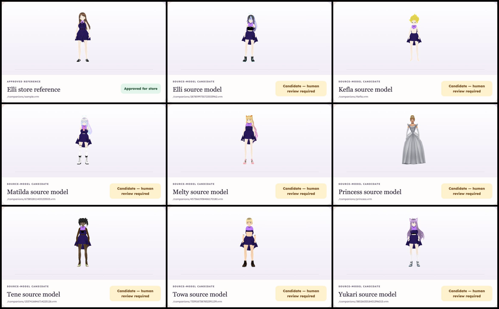

# Ribbon Dress body-profile review

Date: 2026-08-22

This is a sandbox compatibility report, not a store approval for every model.
The diagnostic route deliberately previews the Plum Ribbon Dress on candidate
VRMs; the production store continues to hide every outfit that has not been
approved for the companion's body profile.

## Current result

| Case | Body profile | Store status | Full-size observation |
| --- | --- | --- | --- |
| Elli store reference (`sample.vrm`) | `sunny-standard-v1` | Approved | Complete bodice and skirt; current reference fit. |
| Elli source model | `vroid-slim-v1` | Candidate | Source clothing remains visible around the midriff; not store-ready. |
| Matilda source model | `vroid-slim-v1` | Candidate | Source layers remain visible and the dress does not replace the body clothing cleanly. |
| Kefla source model | `kefla-v1` | Candidate | The dress is incomplete across the torso and base layers remain visible. |
| Melty source model | `melty-compact-v1` | Candidate | Torso and lower-body layering differs from the approved reference. |
| Princess source model | `princess-tall-v1` | Candidate | The reference dress is not visibly applied; the original gown remains. |
| Tene source model | `tene-long-arm-v1` | Candidate | The bodice/underlayer boundary is visibly incompatible. |
| Towa source model | `towa-athletic-v1` | Candidate | The torso breaks into separate bands instead of one fitted dress. |
| Yukari source model | `yukari-long-leg-v1` | Candidate | The torso and base outfit remain visibly separated. |

## Store invariant

- Ribbon Dress variants are sellable only for `sunny-standard-v1`.
- Unknown body profiles receive accessories only.
- The Constellation Blazer and Comet Hoodie remain rejected XWear candidates
  and do not enter the catalog.
- Candidate preview is available only under `wardrobeCompatibilityLab=true`.
- No garment-volume scaling is used to disguise a failed visual fit.

## Human decision requested

Review the contact sheet at full size. The conservative recommendation is to
keep only the current Elli store reference approved and leave all source-model
cases as candidates until a garment is authored specifically for their body
profile.

## Standard-body identity pilot

Added 2026-08-23. The compatibility lab now contains one deliberately narrow
pilot: `Matilda identity on standard body`.

- The approved `sample.vrm` remains the only skeleton and body wearing the
  garment.
- Matilda's source VRM contributes identity materials only: face, eyes, front
  hair, and back hair.
- The identity overlay receives the standard body's normalized pose and is
  pinned to the standard head every frame.
- A failed identity load restores the complete standard avatar and logs the
  failure; it never exposes a half-rendered composite to the store.
- The pilot remains `candidate` until a full-size human review confirms the
  face/hair identity, neck seam, idle alignment, and Ribbon Dress fit.
- This pilot synchronizes body pose and hair physics only. Cross-VRM facial
  expression mapping is a separate requirement before this technique can be
  used in live companion conversation.

This answers a different question than the source-model matrix. The matrix
proved that one garment cannot be assumed to fit unrelated bodies. The pilot
tests whether visual identity can be separated from a standardized clothing
body without losing the companion's recognizable appearance.
